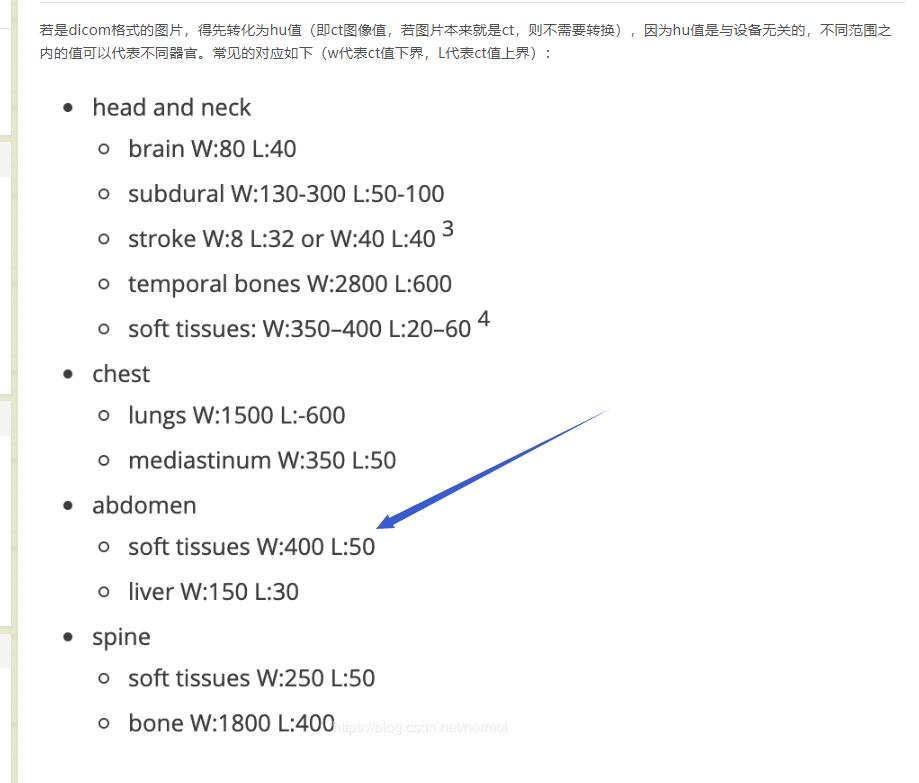

# unet-match
泰迪杯B题直肠癌淋巴结转移- 目前正在更新中
## 进度，初步的网络构建成功，现在正在做图像增强相关的事情。
### 今日份工作，
- 调整hu值的计算公式，我们需要理解hu值得意义，他能够做到根据我组织对于放射性得反射程度显示出特定位置得信息，例如下图 在这个范围内得才是我们需要考虑得数据。
- 
- 最后做了一个简单得图像增强，把数据乘2  特征之间得对比变得稍微大一点。
- 